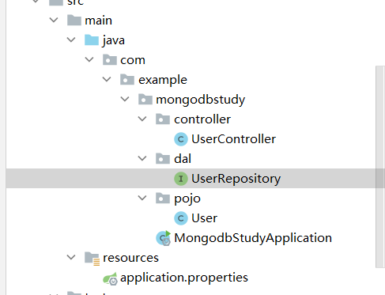
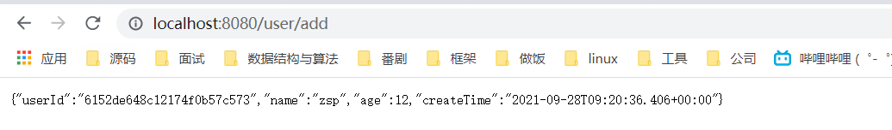
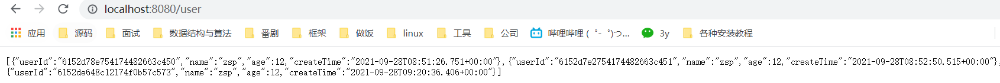
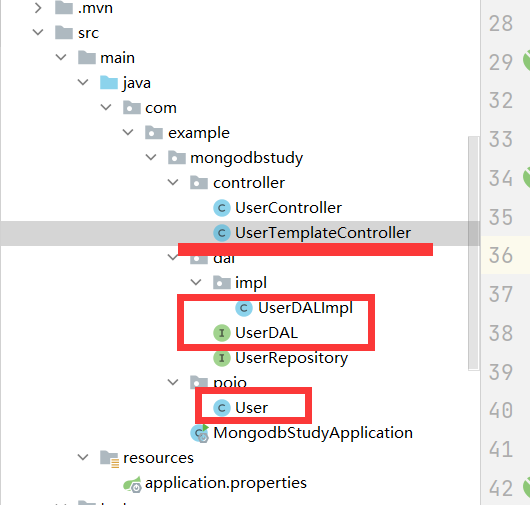
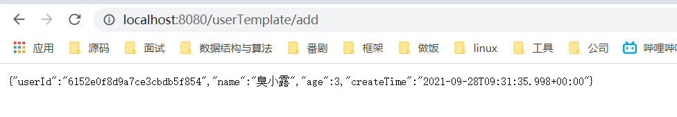
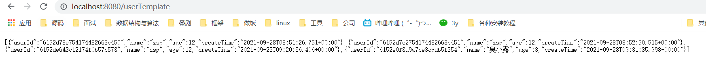

# Mongodb的学习

## Mongodb使用

我家臭宝急着要用，就忽略掉前面的介绍过程了，以后有空再补上。使Mongobd很简单，一共就三步：

### 导入依赖

​	这是全部的依赖了，需要什么后面再加：

```java
<dependencies>
    <dependency>
        <groupId>org.springframework.boot</groupId>
        <artifactId>spring-boot-starter</artifactId>
    </dependency>
    <dependency>
        <groupId>org.springframework.boot</groupId>
        <artifactId>spring-boot-starter-data-mongodb</artifactId>
    </dependency>
    <dependency>
        <groupId>org.springframework.boot</groupId>
        <artifactId>spring-boot-starter-web</artifactId>
    </dependency>
    <dependency>
        <groupId>org.projectlombok</groupId>
        <artifactId>lombok</artifactId>
        <optional>true</optional>
    </dependency>
    <dependency>
        <groupId>org.springframework.boot</groupId>
        <artifactId>spring-boot-starter-test</artifactId>
        <scope>test</scope>
    </dependency>
</dependencies>
```

### 写配置文件

```properties
server.port=8080

spring.data.mongodb.authentication-database=admin
spring.data.mongodb.database=zspdb
spring.data.mongodb.username=root
spring.data.mongodb.password=123456
spring.data.mongodb.host=121.xxx.202.xxx
spring.data.mongodb.port=3306
```

### 业务代码

#### 使用方式1

目录结构如下：



##### 创建实体类

```java
package com.example.mongodbstudy.pojo;
import org.springframework.data.annotation.Id;
import java.util.Date;
public class User {
    @Id
    private String userId;
    private String name;
    private Integer age;
    private Date createTime = new Date();

    public String getUserId() {
        return userId;
    }

    public void setUserId(String userId) {
        this.userId = userId;
    }

    public String getName() {
        return name;
    }

    public void setName(String name) {
        this.name = name;
    }

    public Integer getAge() {
        return age;
    }

    public void setAge(Integer age) {
        this.age = age;
    }

    public Date getCreateTime() {
        return createTime;
    }

    public void setCreateTime(Date createTime) {
        this.createTime = createTime;
    }
}
```

##### 继承MongoDB的库

```java
package com.example.mongodbstudy.dal;

import com.example.mongodbstudy.pojo.User;
import org.springframework.data.mongodb.repository.MongoRepository;
import org.springframework.stereotype.Repository;

@Repository
public interface UserRepository extends MongoRepository<User, String> {
}
```

##### 实现接口

存储有两个方法，一个是save可以存储单个实体类，一个是saveAll可以存储list集合：

```java
package com.example.mongodbstudy.controller;

import com.example.mongodbstudy.dal.UserRepository;
import com.example.mongodbstudy.pojo.User;
import org.springframework.beans.factory.annotation.Autowired;
import org.springframework.web.bind.annotation.*;

import java.util.Date;
import java.util.List;

@RestController
@RequestMapping("/user")
public class UserController {
    @Autowired
    private final UserRepository userRepository;

    public UserController(UserRepository userRepository) {
        this.userRepository = userRepository;
    }

    @GetMapping("")
    public List<User> getAllUsers() {
        return userRepository.findAll();
    }

    @GetMapping("/{userId}")
    public User getByUserId(@PathVariable String userId) {
        return userRepository.findById(userId).orElse(new User());
    }

    @GetMapping("/add")
    public User addNewUser() {
        User user = new User();
        user.setAge(12);
        user.setName("zsp");
       	//这边的save有两个方法，一个是存实体类
        //另一个是存实体类集合，用 saveAll(userlist);
        //userRepository.saveAll(userlist);
        return userRepository.save(user);

    }

    @DeleteMapping("/{userId}")
    public String delete(@PathVariable String userId) {
        User user = new User();
        user.setUserId(userId);
        userRepository.deleteById(userId);
        return "deleted: " + userId;
    }

    @PutMapping("")
    public User update(@RequestBody User user) {
        return userRepository.save(user);
    }
}
```

添加一条进去：

查询一下：



#### 使用方法2

这里使用的是temple，使用原有的实体类即可:

##### 新建一个UserDAL

```java
package com.example.mongodbstudy.dal;

import com.example.mongodbstudy.pojo.User;

import java.util.List;

public interface UserDAL {
    List<User> findAll();

    User findById(String userId);

    User save(User user);

    void deleteById(String userId);
}
```

##### 写一个实现类继承

```java
package com.example.mongodbstudy.dal.impl;

import com.example.mongodbstudy.dal.UserDAL;
import com.example.mongodbstudy.pojo.User;
import org.springframework.beans.factory.annotation.Autowired;
import org.springframework.data.mongodb.core.MongoTemplate;
import org.springframework.data.mongodb.core.query.Criteria;
import org.springframework.stereotype.Repository;

import javax.management.Query;
import java.util.List;

@Repository
public class UserDALImpl implements UserDAL {

    @Autowired
    private MongoTemplate template;

    @Override
    public List<User> findAll() {
        return template.findAll(User.class);
    }

    @Override
    public User findById(String userId) {
        return template.findById(userId,User.class);
    }

    @Override
    public User save(User user) {
        return template.save(user);
    }

    @Override
    public void deleteById(String userId) {

    }


}
```

##### 实现接口


```java
package com.example.mongodbstudy.controller;

import com.example.mongodbstudy.dal.UserDAL;
import com.example.mongodbstudy.pojo.User;
import org.springframework.beans.factory.annotation.Autowired;
import org.springframework.web.bind.annotation.*;

import java.util.ArrayList;
import java.util.List;

@RestController
@RequestMapping("/userTemplate")
public class UserTemplateController {

    @Autowired
    private final UserDAL userDAL;

    public UserTemplateController(UserDAL userDAL) {
        this.userDAL = userDAL;
    }


    @GetMapping("")
    public List<User> getAllUsers() {
        return userDAL.findAll();
    }

    @GetMapping("/{userId}")
    public User getByUserId(@PathVariable String userId) {
        return userDAL.findById(userId);
    }

    @GetMapping("add")
    public User addNewUser() {
        User user1 = new User();
        user1.setName("臭小露");
        user1.setAge(3);
        return userDAL.save(user1);
    }

    @DeleteMapping("/{userId}")
    public String delete(@PathVariable String userId) {
        User user = new User();
        user.setUserId(userId);
        userDAL.deleteById(userId);
        return "deleted: " + userId;
    }

    @PutMapping("")
    public User update(@RequestBody User user) {
        return userDAL.save(user);
    }
}
```

整体项目结构：



测试一下：

把我家臭小露添加上去成功：



查询一下，臭小露在的！

